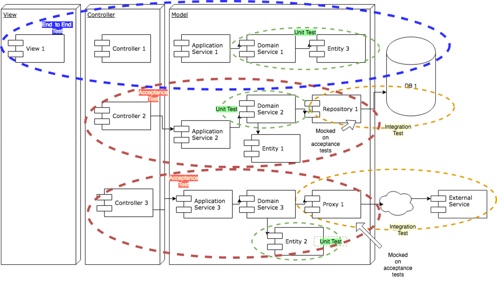
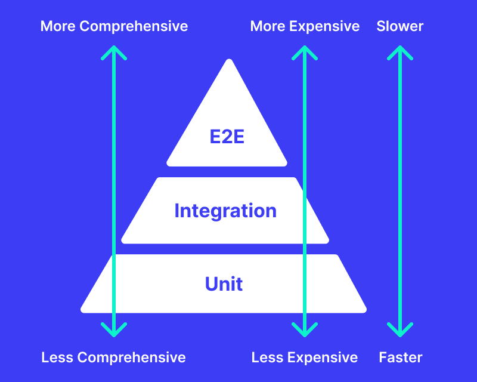
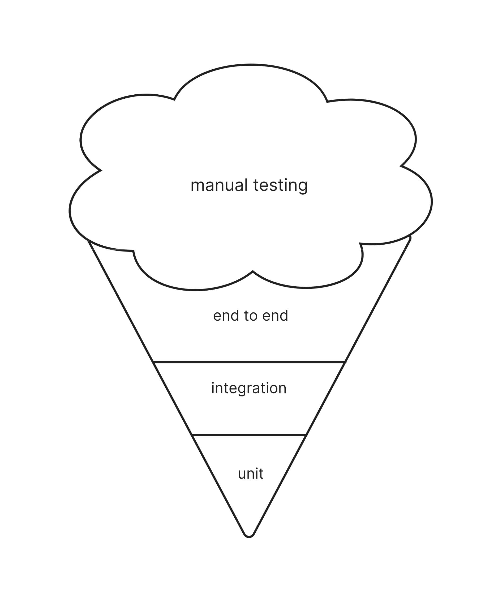

# Типы тестов
Timing: 20 min
## Флип: Какие типы тестов есть?
- unit
- integration
- acceptance
- end to end

Разные авторы используют разную терминологию. Будьте к этому готовы. Мы берем за основу терминологию из книги Agile Technical Practices Distilled.

## Проектор: Границы применимости тестов
Чем отличаются разные типы тестов, хорошо видно на картинке из книги Agile Technical Practices Distilled.
  
  

  
  
## Флипы: Пирамида тестирования

Это способ взглянуть на количество тестов разного вида для создания сбалансированного покрытия. Важная особенность, чтобы было больше низкоуровневых модульных тестов, чем высокоуровневых.

Антипаттерн сбалансированного покрытия: рожок с мороженым вместо пирамиды, где большая часть ручного тестирования.

## Флип: Мини-практика
> Обсуждение

Сервис с UI, который делит одно число на другое. Какими тестами его нужно покрывать на каких уровнях? Приведите примеры тестов и их распределение по уровням.

