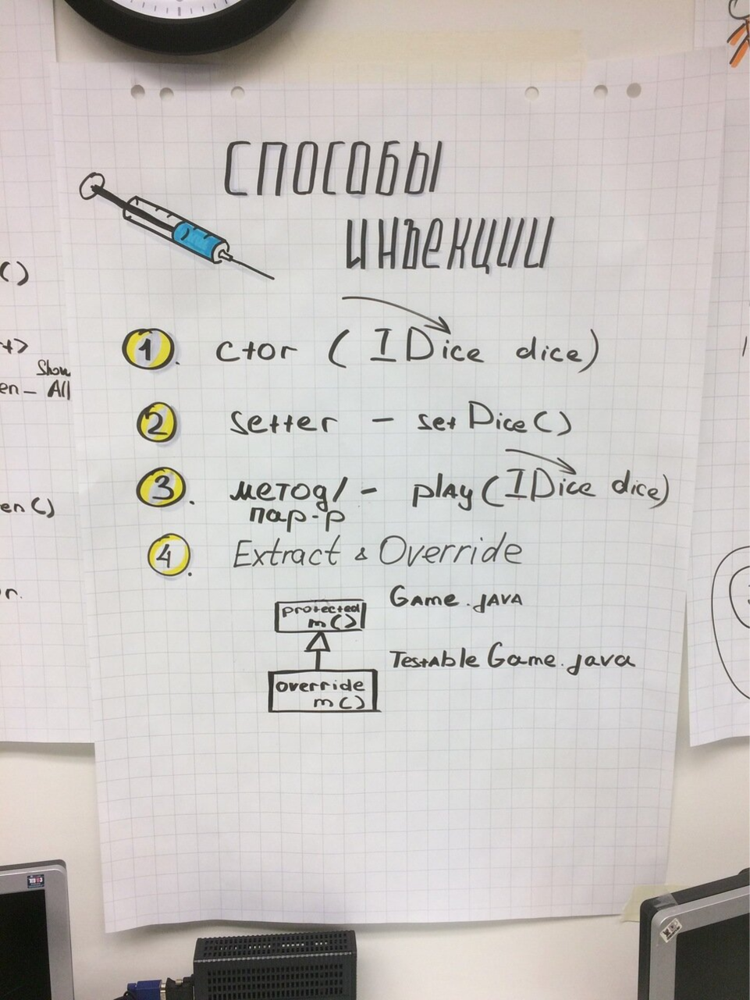
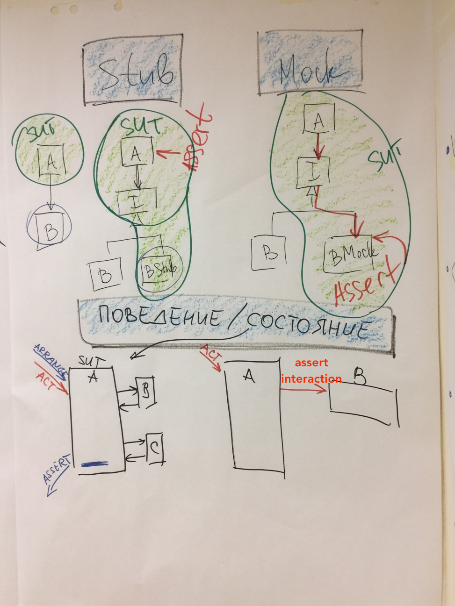

# Тест-дубли
## Stub, Mock, Fake, Spy
Разные авторы используют разную терминологию. Будьте к этому готовы. Мы берем за основу терминологию Роя Ошерова из книги "The art of unit testing"
- Тестовый дублер
    - Любой объект, который используется в тестах вместо реального объекта
- Stub
    - Заглушка
    - Управляемый дублер внешней зависимости
    - Используется в Arrange
- Mock
    - Дублер, который используется для регистрации внешних вызовов и проверки факта этого вызова или его отсутствия
    - Может быть строгим или нестрогим
    - Используется только в Assert
- Spy
    - Дублер - декоратор над реальным объектом, который регистрирует вызовы
    - Используется только в Assert
- Fake
    - Объект, который может использоваться и как Stub и как Mock

В Agile technical practices distilled используется чуть другая терминология, но близкая

## Способы инъекции дублеров

## Полезные советы использования дублеров
- Command-Query Separation
    - Команда изменяет состояние, но ничего не возвращает
        - Можно вернуть, это слабое нарушение
    - Запрос сообщает состояние, но не изменяет
- Используйте Stub для Запросов в Arrange
- Используйте Mock для проверки Команд в Assert
- Подменяйте только те классы, которыми вы владеете
    - Как подменять внешние библиотеки или зависимости? — Используйте классы-обертки и подменяйте их
- Проверяйте как можно меньше
- Длинные проверки привязывают тесты к реализации → мешают рефакторингу
- Обходитесь без дублеров, если можете обойтись
    - Например для тестирования изолированных объектов
    - Используйте реальные доменные объекты, не бойтесь расширять SUT
- Не добавляйте поведение в дублеров
    - Дублирование логики
    - Риск начать тестировать логику дублера вместо продакшн кода
- Подменяйте только непосредственные зависимости
    - Сложная инициализация
    - Соблюдайте Закон Деметры
    - Class A -> Class B -> Class C
        - Не подменяйте Class С, вместо этого подмените Class B
- Если в тестах слишком много дублеров, меняйте дизайн

## Тесты на поведение/состояние

Задача: Понять разницу между тестами на поведение и тестами на состояние
- Поведение
    - Game.Play() бросает кубик
    - Game.Play() вызывает Player.Win() для всех игроков в игре, сделавших правильную ставку
    - Game.Play() вызывает Player.Lose() для всех игроков в игре, сделавших неправильную ставку
- Состояние
    - После Game.Play() игрок, сделавший правильную ставку, выиграл 6 ставок
    - После Game.Play() все игроки, сделавшие правильные ставки, выиграли по 6 ставок каждый
    - После Game.Play() игрок, сделавший неправильную ставку, проиграл ставку
    - После Game.Play() все игроки, сделавшие неправильные ставки, проиграли свои ставки

Тесты на поведение более хрупкие, так как знают топологию классов.

TODO: надо ли это тут?
Дебриф: обращаем внимание на
- Наименование теста
- Структуру теста (AAA)
- Отличие тестов на состояние и поведение
- Лаконичность и выразительность теста
- Тестовые данные важны для теста
- Тестируется логика классов, а не тестовых дублеров
