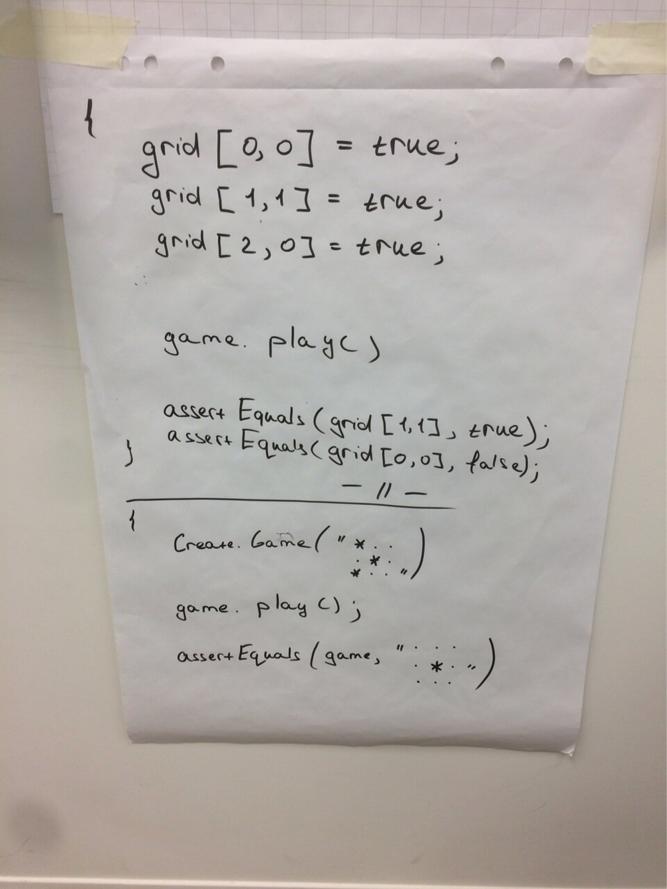

# Качество тестов: DSL
Timing: 45-60 min

Мы сделали проще и легче с фикстурами. Но тесты всё ещё оечнь технические. Как сделать так, чтобы тесты стали вашими требованиями и все в вашей команде могли читать их?

### Польза DSL
- Тесты становятся читаемыми для любого, кто знаком с предметной областью
    - Общий язык
- Тесты легко писать
    - Create. подскажет какие сущности есть в вашем домене
    - Create.Entity() создаст валидную сущность
    - Create.Entity(). подскажет как можно параметризовать сущность
    - Скрытие данных: в тесте только то, что важно для теста
    - Легко расширять по аналогии

### Практика
#### Правила игры жизнь (Game of Life)
  
- Игра происходит на клеточном поле - «вселенной».
- Каждая клетка может быть живой или мёртвой (пустой).
- Поколения сменяются синхронно по простым правилам:
   - в пустой клетке, рядом с которой ровно три живых, зарождается жизнь
   - если у живой клетки есть два или три живых соседа, то клетка продолжает жить
   - если соседей меньше двух или больше трёх, то клетка умирает «от одиночества» или «от перенаселённости»
   
#### Тесты
  
- Придумать, какие нужны тесты 
- Подумать, как могут выглядеть DSL-style тесты
  

#### Тесты на Dice Roll Game
[Практика](/practice/day1/07_dsl.md) - напишите DSL тесты на Dice Roll Game.

### Дебриф на DSL
В чём вы видите разницу - с DSL и без DSL? Где в работе вам это бы пригодилось?
