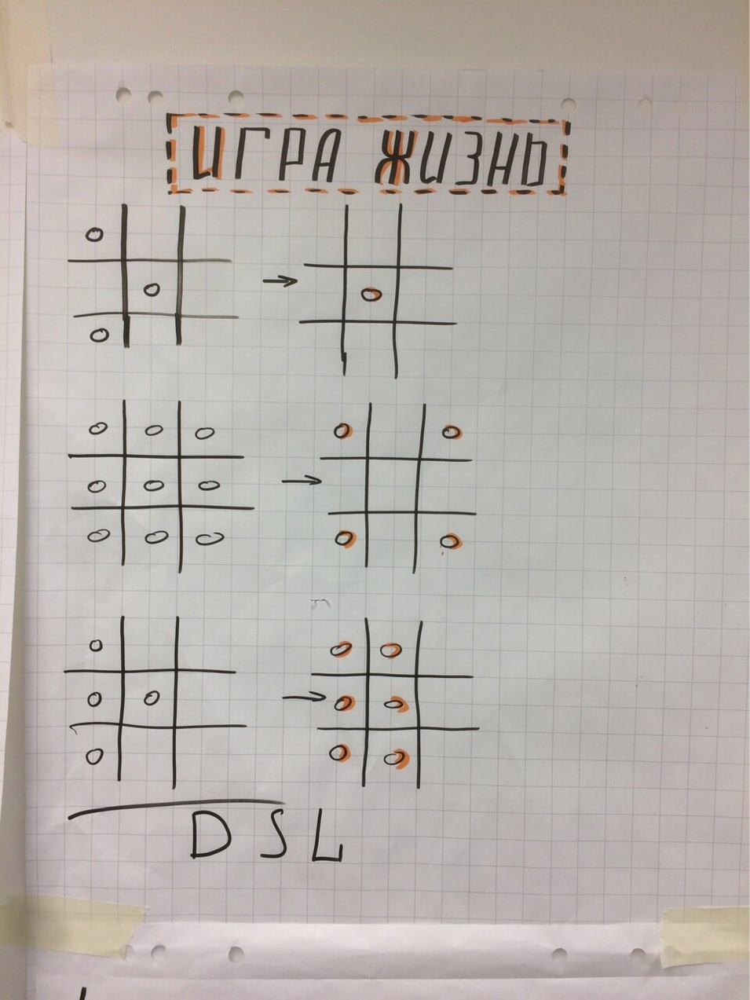

# Качество тестов: DSL
Мы сделали проще и легче с фикстурами. Но тесты всё ещё оечнь технические. Как сделать так, чтобы тесты стали вашими требованиями и все в вашей команде могли читать их?

### Польза DSL
- Тесты становятся читаемыми для любого, кто знаком с предметной областью
    - Общий язык
- Тесты легко писать
    - Create. подскажет какие сущности есть в вашем домене
    - Create.Entity() создаст валидную сущность
    - Create.Entity(). подскажет как можно параметризовать сущность
    - Скрытие данных: в тесте только то, что важно для теста
    - Легко расширять по аналогии

### Практика
#### Правила игры жизнь

#### Тесты
Предложить придумать, как могли бы выглядеть тесты. Вместо сформулировать первый вариант. Затем вместе предложить, подумать, как могли бы выглядеть DSL-style тесты.

#### Тесты на Dice Roll Game
Напишите DSL тесты на Dice Roll Game.

### Дебриф на DSL
В чём вы видите разницу - с DSL и без DSL? Где в работе вам это бы пригодилось?
