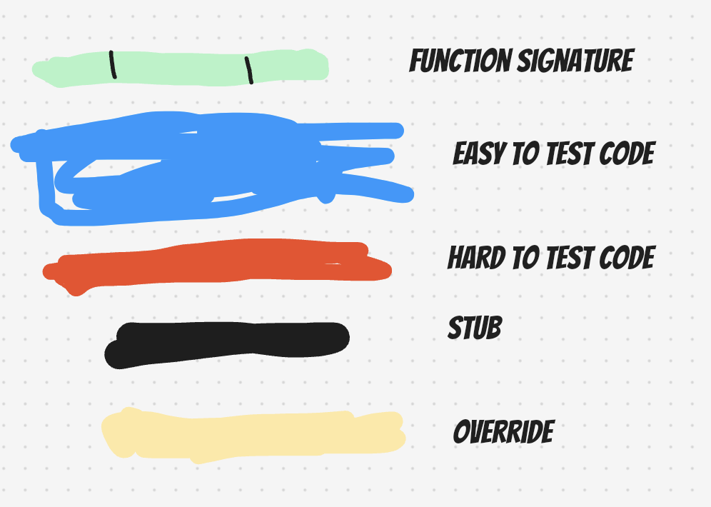
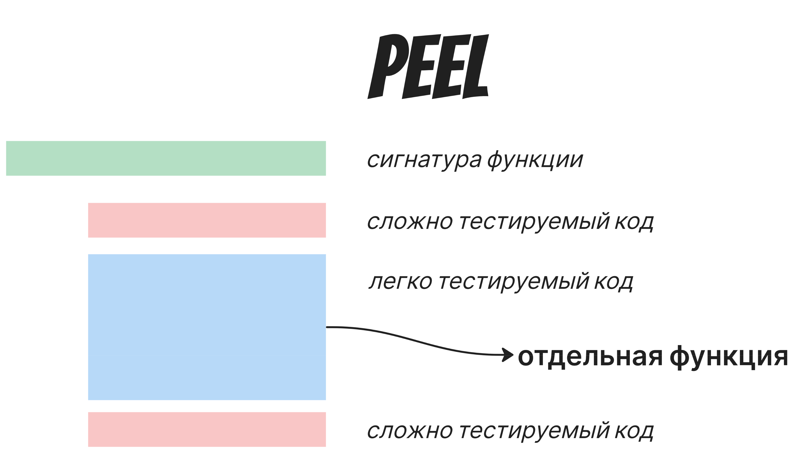
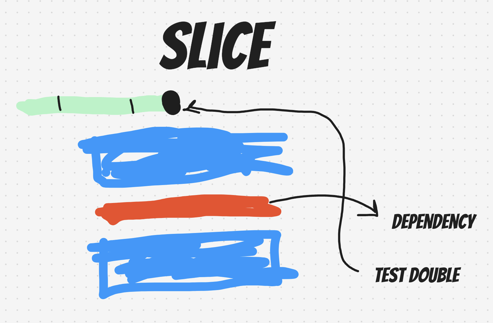
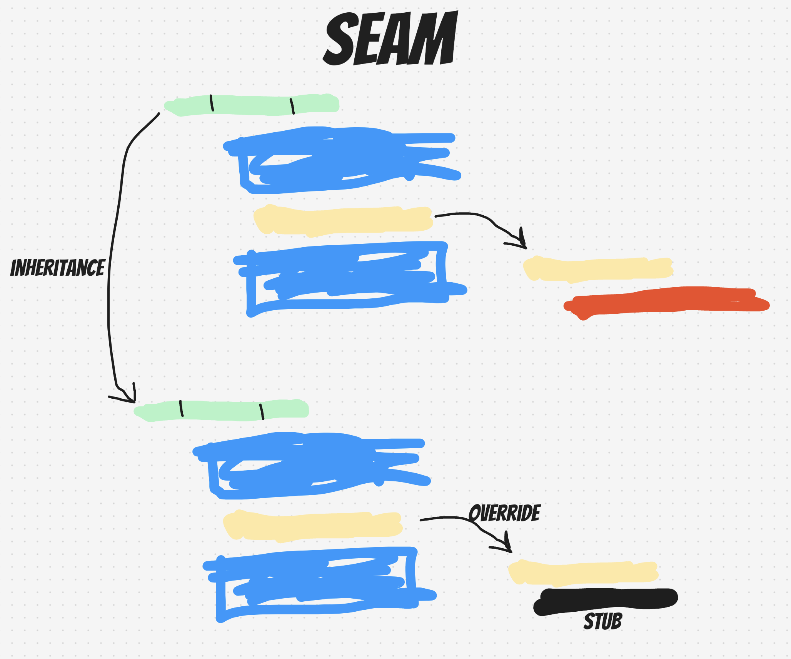

# Тестопригодность кода
Timing: 45 min
## Обсуждение + флип
Когда код был у вас нетестируемый?

## Какой код тестируемый?
- immutable объекты
- разделение Command / Query
- маленькие модули
- низкая связность
- единая отвественность модуля
- DI (dependency injection) все зависимости передаются извне
  - Конструктор (постоянная зависимость, жизненный цикл длительный)
  - Свойство
  - Параметр (жизненный цикл короткий)
- детерминированность, код выдает одинаковый результат (постоянное - в конструктор, транзиентное - в параметр)

## Seam, peel, slice

### Peel
Выносим чистую логику внутрь отдельной функции, «отшелушивая» зависимости наружу.

### Slice
Разрезаем стек по слою зависимости и подставляем test double на её место.

### Seam
Создаём шов через наследование: переопределяем (override) зависимый метод в подклассе и подставляем stub.

Seam - шов. Нередко это используется как общее название подобных подходов. То есть и спомощью peel и с помощью slice мы по сути создаём "швы" в коде.

## Практика
Напишите тесты на отчёт в gilded rose
TODO:добавить практику с отчётом

## Дебриф
Где в вашем проекте это может пригодиться?
